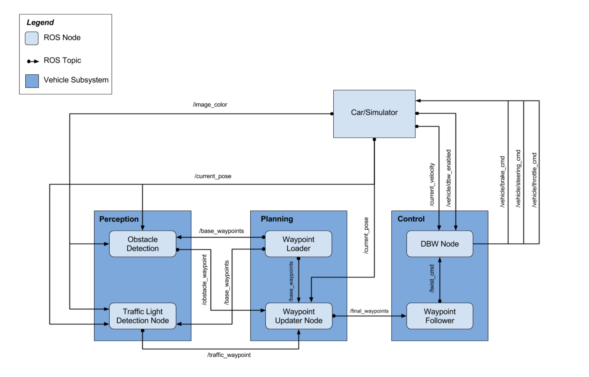

This is the project repo for the final project of the Udacity Self-Driving Car Nanodegree: Programming a Real Self-Driving Car. For more information about the project, see the project introduction [here](https://classroom.udacity.com/nanodegrees/nd013/parts/6047fe34-d93c-4f50-8336-b70ef10cb4b2/modules/e1a23b06-329a-4684-a717-ad476f0d8dff/lessons/462c933d-9f24-42d3-8bdc-a08a5fc866e4/concepts/5ab4b122-83e6-436d-850f-9f4d26627fd9).

# Project Overview
In this project, you'll be writing ROS nodes to implement core functionality of the autonomous vehicle system, including traffic light detection, control, and waypoint following! You will test your code using a simulator that mimics the functionality on Carla.

The following is a system architecture diagram showing the ROS nodes and topics used in the project. You can refer to the diagram throughout the project as needed. The ROS nodes and topics shown in the diagram are described briefly in the Code Structure section below, and more detail is provided for each node in later classroom concepts of this lesson.

[]

Carla has three subsystems:

Perception - Carla's camera and sensors detect obstacles and traffic lights. In this project, we need to implement a node for traffic light detection. We chose to train a deep learning network model for the traffic light classification.

Planning - The planning subsystem (node waypoint updater) updates the waypoints and the associated target velocities. It consisits of two modules, waypoint_updater and waypont_loader. In this project implementation, a list of final waypoints will be updated using the information from the simulation and the perception module.

Control - The control subsystem actuates the throttle, steering, and brake to navigate the waypoints with the target velocity. Carla is equipped with a drive-by-wire(dbw) system and we are expected to implement the DBW node that generates the throttle, steering, and brake control signals.


# Suggested Order of Project Development

Below are some suggestion inputs which i took from the Udacity project class chapter.

Because we will be writing code across several packages with some nodes depending on messages published by other nodes, we suggest completing the project in the following order:

### Waypoint Updater Node (Partial): 
Complete a partial waypoint updater which subscribes to /base_waypoints and **/current_pose** and publishes to **/final_waypoints**.

### DBW Node: 
Once your waypoint updater is publishing **/final_waypoints**, the waypoint_follower node will start publishing messages to the **/twist_cmd** topic. At this point, you have everything needed to build the dbw_node. After completing this step, the car should drive in the simulator, ignoring the traffic lights.

### Traffic Light Detection: 
This can be split into 2 parts:
(Optional) Detection: Detect the traffic light and its color from the **/image_color**. 
The topic **/vehicle/traffic_lights** contains the exact location and status of all traffic lights in simulator, so you can test your output.

### Waypoint publishing: 
Once you have correctly identified the traffic light and determined its position, you can convert it to a waypoint index and publish it.

**Waypoint Updater (Full):**
Use **/traffic_waypoint** to change the waypoint target velocities before publishing to **/final_waypoints**. Your car should now stop at red traffic lights and move when they are green.


# Installations
Please use **one** of the two installation options, either native **or** docker installation.

### Native Installation

* Be sure that your workstation is running Ubuntu 16.04 Xenial Xerus or Ubuntu 14.04 Trusty Tahir. [Ubuntu downloads can be found here](https://www.ubuntu.com/download/desktop).
* If using a Virtual Machine to install Ubuntu, use the following configuration as minimum:
  * 2 CPU
  * 2 GB system memory
  * 25 GB of free hard drive space

  The Udacity provided virtual machine has ROS and Dataspeed DBW already installed, so you can skip the next two steps if you are using this.

* Follow these instructions to install ROS
  * [ROS Kinetic](http://wiki.ros.org/kinetic/Installation/Ubuntu) if you have Ubuntu 16.04.
  * [ROS Indigo](http://wiki.ros.org/indigo/Installation/Ubuntu) if you have Ubuntu 14.04.
* Download the [Udacity Simulator](https://github.com/udacity/CarND-Capstone/releases).

### Docker Installation
[Install Docker](https://docs.docker.com/engine/installation/)

Build the docker container
```bash
docker build . -t capstone
```

Run the docker file
```bash
docker run -p 4567:4567 -v $PWD:/capstone -v /tmp/log:/root/.ros/ --rm -it capstone
```

### Port Forwarding
To set up port forwarding, please refer to the "uWebSocketIO Starter Guide" found in the classroom (see Extended Kalman Filter Project lesson).

### Usage

1. Clone the project repository
```bash
git clone https://github.com/udacity/CarND-Capstone.git
```

2. Install python dependencies
```bash
cd CarND-Capstone
pip install -r requirements.txt
```
3. Make and run styx
```bash
cd ros
catkin_make
source devel/setup.sh
roslaunch launch/styx.launch
```
4. Run the simulator

### Real world testing
1. Download [training bag](https://s3-us-west-1.amazonaws.com/udacity-selfdrivingcar/traffic_light_bag_file.zip) that was recorded on the Udacity self-driving car.
2. Unzip the file
```bash
unzip traffic_light_bag_file.zip
```
3. Play the bag file
```bash
rosbag play -l traffic_light_bag_file/traffic_light_training.bag
```
4. Launch your project in site mode
```bash
cd CarND-Capstone/ros
roslaunch launch/site.launch
```
5. Confirm that traffic light detection works on real life images

### Other library/driver information
Outside of `requirements.txt`, here is information on other driver/library versions used in the simulator and Carla:

Specific to these libraries, the simulator grader and Carla use the following:

|        | Simulator | Carla  |
| :-----------: |:-------------:| :-----:|
| Nvidia driver | 384.130 | 384.130 |
| CUDA | 8.0.61 | 8.0.61 |
| cuDNN | 6.0.21 | 6.0.21 |
| TensorRT | N/A | N/A |
| OpenCV | 3.2.0-dev | 2.4.8 |
| OpenMP | N/A | N/A |

We are working on a fix to line up the OpenCV versions between the two.
